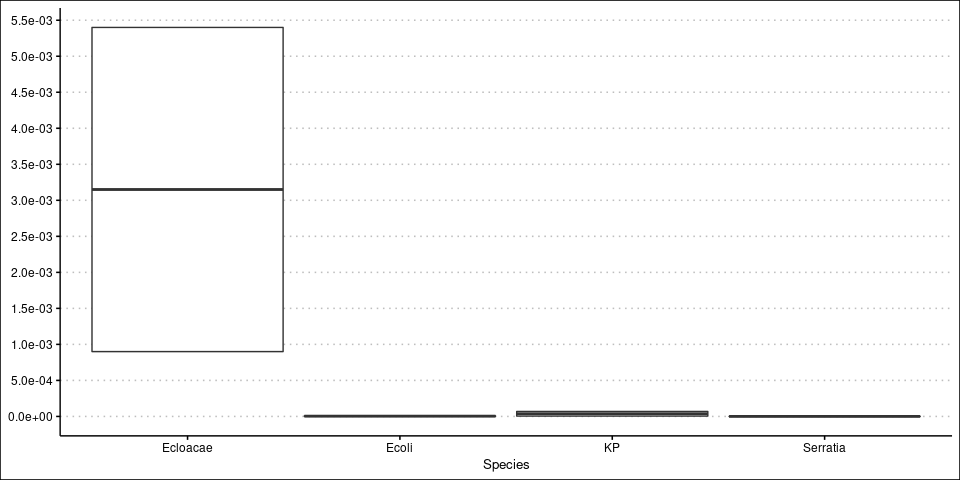

## Boxplots

This markdown is inspired by this [SO post](https://stackoverflow.com/questions/11952819/is-it-possible-to-plot-a-boxplot-from-previously-calculated-statistics-easily-i).

Suppose, we have of set of summary stats from various datasets such as max, min, mean. For example, in this case, I have max, min, mean substitution rate that I calculated from BEAST tool. Now, I want to plot the values into box-plots for each of the species. Usually boxplots from the ggplot2 calculates these values and Quartile values from the dataset, is there a way to plot the pre-calculated values we calculated into elegant boxplots? 

Yes. The following is one approach to the above questions. 

Let us start by creating some dummy substitution rates for each species!!

### 1. Basic Boxplot


```r
library(ggplot2)
setwd("Plot_SubstitutionRates")

df <- read.table("rates.list",header = TRUE, sep = "\t")
df
```

```
##    Species HPD_interval_Lowerbound HPD_interval_Upperbound      Mean
## 1 Serratia                 4.9e-08                3.54e-07 1.770e-07
## 2    Ecoli                 3.2e-07                7.68e-06 4.000e-06
## 3       KP                 4.6e-06                6.87e-05 3.665e-05
## 4 Ecloacae                 9.0e-04                5.40e-03 3.150e-03
```

```r
ggplot(
  df,
  aes(
    x = Species,
    ymin = HPD_interval_Lowerbound,
    lower = HPD_interval_Lowerbound,
    middle = Mean,
    upper = HPD_interval_Upperbound,
    ymax = HPD_interval_Upperbound,
  )
) +
  geom_boxplot(stat = "identity")
```

<!-- -->

### 2. Let us add a blank and white theme now


```r
ggplot(
  df,
  aes(
    x = Species,
    ymin = HPD_interval_Lowerbound,
    lower = HPD_interval_Lowerbound,
    middle = Mean,
    upper = HPD_interval_Upperbound,
    ymax = HPD_interval_Upperbound,
  )
) +
  geom_boxplot(stat = "identity") + ggthemes::theme_clean()
```

<!-- -->

### 3. Let us make the Y-axis numbers into the exponential form


```r
ggplot(
  df,
  aes(
    x = Species,
    ymin = HPD_interval_Lowerbound,
    lower = HPD_interval_Lowerbound,
    middle = Mean,
    upper = HPD_interval_Upperbound,
    ymax = HPD_interval_Upperbound,
  )
) +
  geom_boxplot(stat = "identity") + scale_y_continuous(
    labels = function(x)
      format(x, scientific = TRUE)
  ) + ggthemes::theme_clean()
```

<!-- -->

### 4. Let us increase Yaxis breakpoints


```r
library(scales)

max_val <- max(df$HPD_interval_Upperbound)

# Let pretty breaks decide the breaks for the Y-axis
ggplot(
  df,
  aes(
    x = Species,
    ymin = HPD_interval_Lowerbound,
    lower = HPD_interval_Lowerbound,
    middle = Mean,
    upper = HPD_interval_Upperbound,
    ymax = HPD_interval_Upperbound,
  )
) +
  geom_boxplot(stat = "identity") + scale_y_continuous(
    labels = function(x)
      format(x, scientific = TRUE), breaks=pretty_breaks(),
    limits = c(0, max_val)
  ) + ggthemes::theme_clean()
```

<!-- -->

```r
# but this is not what I want. 
```

### 5. Let's try something else with pretty breaks

In this plot pretty breaks function automatically breaks the axis
`n` means Desired number of breaks. You may get slightly more or fewer breaks that requested


```r
ggplot(
  df,
  aes(
    x = Species,
    ymin = HPD_interval_Lowerbound,
    lower = HPD_interval_Lowerbound,
    middle = Mean,
    upper = HPD_interval_Upperbound,
    ymax = HPD_interval_Upperbound,
  )
) +
  geom_boxplot(stat = "identity") + scale_y_continuous(
    labels = function(x)
      format(x, scientific = TRUE), breaks=breaks_pretty(n=10),
    limits = c(0, max_val)
  ) + ggthemes::theme_clean()
```

<!-- -->

### 6. Fixing box sizes

Hmm. The problem with one of the species having higher mutation rate is showing the rate of other species very small boxes.
Lets see, if we can fix this.


```r
ggplot(
  df,
  aes(
    x = Species,
    ymin = HPD_interval_Lowerbound,
    lower = HPD_interval_Lowerbound,
    middle = Mean,
    upper = HPD_interval_Upperbound,
    ymax = HPD_interval_Upperbound,
  )
) +
  geom_boxplot(stat = "identity") + scale_y_continuous(
    labels = function(x)
      format(x, scientific = TRUE),
    breaks = c(
      0,
      0.1,
      0.01,
      0.001,
      0.0001,
      0.00001,
      0.000001,
      0.0000001,
      0.00000001,
      0.000000001,
      0.0000000001
    ),
    limits = c(0, max_val)
  ) + ggthemes::theme_clean()
```

<!-- -->

```r
# Still cannot work
```

### 7. Fixing box sizes

Let us `scale_y_log10()` from scales package. Amazing. The following works! Just that the Y-axis is decimal format. 


```r
ggplot(
  df,
  aes(
    x = Species,
    ymin = HPD_interval_Lowerbound,
    lower = HPD_interval_Lowerbound,
    middle = Mean,
    upper = HPD_interval_Upperbound,
    ymax = HPD_interval_Upperbound,
  )
) +
  geom_boxplot(stat = "identity") + scale_y_log10() + 
  ggthemes::theme_clean()
```

<!-- -->

### 8. Fixing box sizes by changing to log scale

Let us `scale_y_log10()` from scales package. 

Amazing. The following works! Just that the Y-axis in decimal format is changed to scientific format by `scales::scientific` from `scales` package.


```r
ggplot(
  df,
  aes(
    x = Species,
    ymin = HPD_interval_Lowerbound,
    lower = HPD_interval_Lowerbound,
    middle = Mean,
    upper = HPD_interval_Upperbound,
    ymax = HPD_interval_Upperbound,
  )
) +
  geom_boxplot(stat = "identity") + scale_y_log10(labels = scales::scientific) + 
  ggthemes::theme_base()
```

<!-- -->

### 9. Empty X-axis

Now, final touch ups. I do not want the Species on the x-axis rather I want a label on the box itself
Let's make a separate labels dataset for adding the labels.


```r
Species_labels <- c("Unknown-ST marcescens","ST131 Ecoli","ST141 K.pneumoniae","ST235 E.cloacae")
df_labs <- data.frame(df,Species_labels )
df_labs
```

```
##    Species HPD_interval_Lowerbound HPD_interval_Upperbound      Mean
## 1 Serratia                 4.9e-08                3.54e-07 1.770e-07
## 2    Ecoli                 3.2e-07                7.68e-06 4.000e-06
## 3       KP                 4.6e-06                6.87e-05 3.665e-05
## 4 Ecloacae                 9.0e-04                5.40e-03 3.150e-03
##          Species_labels
## 1 Unknown-ST marcescens
## 2           ST131 Ecoli
## 3    ST141 K.pneumoniae
## 4       ST235 E.cloacae
```

```r
ggplot(
  df_labs,
  aes(
    x = Species,
    ymin = HPD_interval_Lowerbound,
    lower = HPD_interval_Lowerbound,
    middle = Mean,
    upper = HPD_interval_Upperbound,
    ymax = HPD_interval_Upperbound,
  )
) +
  geom_boxplot(stat = "identity") + scale_y_log10(labels = scales::scientific) + 
  ggthemes::theme_base() +
  annotate("text", x=df_labs$Species, y=df_labs$Mean, label= df_labs$Species_labels, vjust=1.7) +
 theme(axis.title.x=element_blank(), axis.text.x=element_blank()) +
  labs(x="Species",
       y="Substitution Rate (SNPs/Sites/Year)",
       title = "Mutation rate across various Enterobacterales Species")
```

<!-- -->
  
### 10. Beautification. Let' Embellish!

Let's use some additional R packages that will make ggplot2 visualizations even better. In this following set of code, we use packages: showtext, patchwork with some example plots.

We are changing the default ggplot2 font to an external fonts with showtext package to make it look much more beautiful. . We pick one of the Google fonts and add the font using `font_add_google`. In this case, we use “Lobster Two” and “Roboto”.


```r
library(showtext)
# download "Lobster Two" and save it as "lobstertwo"
font_add_google("Lobster Two", "lobstertwo")
font_add_google("Roboto", "roboto")
font_add_google("Poppins", "poppins")
showtext_auto()
theme_set(theme_bw())
theme_update(
  legend.text = element_text(size=9, family = "roboto"),
  legend.title = element_text(face="bold", size=12, family = "roboto"),
  legend.position = c(1,0),
  legend.justification = c(1, 0),
  text = element_text(family = "lobstertwo", size = 8, color = "black"),
  plot.title = element_text(family = "lobstertwo", size = 20,
                            face = "bold", color="#2a475e"),
  plot.subtitle = element_text(family = "lobstertwo", size = 15, 
                               face = "bold", color="#1b2838"),
  plot.caption = element_text(size = 10),
  plot.title.position = "plot",
  #plot.caption.position = "plot",
  axis.text = element_text(size = 10, color = "black"),
  axis.title = element_text(size=12),
  axis.ticks = element_blank(),
  axis.line = element_line(colour = "grey50"),
  rect = element_blank(),
  panel.grid = element_line(color = "#b4aea9"),
  panel.grid.minor = element_blank(),
  panel.grid.major.x = element_blank(),
  #panel.grid.major.x = element_line(linetype="dashed"),
  #panel.grid.major.y = element_blank(),
  panel.grid.major.y = element_line(linetype="dashed"),
  plot.background = element_rect(fill = '#fbf9f4', color = '#fbf9f4')
)

ggplot(
  df_labs,
  aes(
    x = Species,
    ymin = HPD_interval_Lowerbound,
    lower = HPD_interval_Lowerbound,
    middle = Mean,
    upper = HPD_interval_Upperbound,
    ymax = HPD_interval_Upperbound,
  )
) +
  geom_boxplot(stat = "identity") + scale_y_log10(labels = scales::scientific) + 
  #ggthemes::theme_base() +
  annotate("text", x=df_labs$Species, y=df_labs$Mean, label= df_labs$Species_labels, vjust=1.7) +
  theme(axis.title.x=element_blank(), axis.text.x=element_blank()) +
  labs(x="Species",
       y="Substitution Rate (SNPs/Sites/Year)",
       title = "Mutation rate across various Enterobacterales Species")
```

<!-- -->

### 11. Fill default color

Let us fill color in each of the species box using default settings!


```r
# Let's color the box for each of the species

ggplot(
  df_labs,
  aes(
    x = Species,
    ymin = HPD_interval_Lowerbound,
    lower = HPD_interval_Lowerbound,
    middle = Mean,
    upper = HPD_interval_Upperbound,
    ymax = HPD_interval_Upperbound,
    fill=Species)
) +
  geom_boxplot(stat = "identity") + scale_y_log10(labels = scales::scientific) + 
  annotate("text", x=df_labs$Species, y=df_labs$Mean, label= df_labs$Species_labels, vjust=1.7) +
  theme(axis.title.x=element_blank(), axis.text.x=element_blank(),legend.position = "none") +
  labs(x="Species",
       y="Substitution Rate (SNPs/Sites/Year)",
       title = "Mutation rate across various Enterobacterales Species")
```

<!-- -->

### 12. Fill color with different palette

Let us change colors by using different set of colors from the palette.


```r
ggplot(
  df_labs,
  aes(
    x = Species,
    ymin = HPD_interval_Lowerbound,
    lower = HPD_interval_Lowerbound,
    middle = Mean,
    upper = HPD_interval_Upperbound,
    ymax = HPD_interval_Upperbound,
    fill=Species)
) +
  geom_boxplot(stat = "identity") + scale_y_log10(labels = scales::scientific) + 
  annotate("text", x=df_labs$Species, y=df_labs$Mean, label= df_labs$Species_labels, vjust=1.7) +
  theme(axis.title.x=element_blank(), axis.text.x=element_blank(),legend.position = "none") +
  labs(x="Species",
       y="Substitution Rate (SNPs/Sites/Year)",
       title = "Mutation rate across various Enterobacterales Species") + scale_fill_brewer(palette="Pastel2")
```

<!-- -->

```r
ggplot(
  df_labs,
  aes(
    x = Species,
    ymin = HPD_interval_Lowerbound,
    lower = HPD_interval_Lowerbound,
    middle = Mean,
    upper = HPD_interval_Upperbound,
    ymax = HPD_interval_Upperbound,
    fill=Species)
) +
  geom_boxplot(stat = "identity") + scale_y_log10(labels = scales::scientific) + 
  annotate("text", x=df_labs$Species, y=df_labs$Mean, label= df_labs$Species_labels, vjust=1.7) +
  theme(axis.title.x=element_blank(), axis.text.x=element_blank(),legend.position = "none") +
  labs(x="Species",
       y="Substitution Rate (SNPs/Sites/Year)",
       title = "Mutation rate across various Enterobacterales Species") + scale_fill_brewer(palette="Accent")
```

<!-- -->

```r
ggplot(
  df_labs,
  aes(
    x = Species,
    ymin = HPD_interval_Lowerbound,
    lower = HPD_interval_Lowerbound,
    middle = Mean,
    upper = HPD_interval_Upperbound,
    ymax = HPD_interval_Upperbound,
    fill=Species)
) +
  geom_boxplot(stat = "identity") + scale_y_log10(labels = scales::scientific) + 
  annotate("text", x=df_labs$Species, y=df_labs$Mean, label= df_labs$Species_labels, vjust=1.7) +
  theme(axis.title.x=element_blank(), axis.text.x=element_blank(),legend.position = "none") +
  labs(x="Species",
       y="Substitution Rate (SNPs/Sites/Year)",
       title = "Mutation rate across various Enterobacterales Species") + scale_fill_brewer(palette="Set2")
```

<!-- -->

### 14. Combine the plots

Let's combine the plots with patchwork package. Since , we are combining the plots, we can have combined title instead one for each. See that I empty out the title in the labs.


```r
library(patchwork)

pastel2 <- ggplot(
  df_labs,
  aes(
    x = Species,
    ymin = HPD_interval_Lowerbound,
    lower = HPD_interval_Lowerbound,
    middle = Mean,
    upper = HPD_interval_Upperbound,
    ymax = HPD_interval_Upperbound,
    fill=Species)
) +
  geom_boxplot(stat = "identity") + scale_y_log10(labels = scales::scientific) + 
  annotate("text", x=df_labs$Species, y=df_labs$Mean, label= df_labs$Species_labels, vjust=1.7) +
  theme(axis.title.x=element_blank(), axis.text.x=element_blank(),legend.position = "none") +
  labs(x="Species",
       y="Substitution Rate (SNPs/Sites/Year)",
       title = ""
       ) + scale_fill_brewer(palette="Pastel2")

accent <- ggplot(
  df_labs,
  aes(
    x = Species,
    ymin = HPD_interval_Lowerbound,
    lower = HPD_interval_Lowerbound,
    middle = Mean,
    upper = HPD_interval_Upperbound,
    ymax = HPD_interval_Upperbound,
    fill=Species)
) +
  geom_boxplot(stat = "identity") + scale_y_log10(labels = scales::scientific) + 
  annotate("text", x=df_labs$Species, y=df_labs$Mean, label= df_labs$Species_labels, vjust=1.7) +
  theme(axis.title.x=element_blank(), axis.text.x=element_blank(),legend.position = "none") +
  labs(x="Species",
       y="Substitution Rate (SNPs/Sites/Year)",
       title = ""
       ) + scale_fill_brewer(palette="Accent")

set2 <- ggplot(
  df_labs,
  aes(
    x = Species,
    ymin = HPD_interval_Lowerbound,
    lower = HPD_interval_Lowerbound,
    middle = Mean,
    upper = HPD_interval_Upperbound,
    ymax = HPD_interval_Upperbound,
    fill=Species)
) +
  geom_boxplot(stat = "identity") + scale_y_log10(labels = scales::scientific) + 
  annotate("text", x=df_labs$Species, y=df_labs$Mean, label= df_labs$Species_labels, vjust=1.7) +
  theme(axis.title.x=element_blank(), axis.text.x=element_blank(),legend.position = "none") +
  labs(x="Species",
       y="Substitution Rate (SNPs/Sites/Year)",
       title = ""
       ) + scale_fill_brewer(palette="Set2")

dark2 <- ggplot(
  df_labs,
  aes(
    x = Species,
    ymin = HPD_interval_Lowerbound,
    lower = HPD_interval_Lowerbound,
    middle = Mean,
    upper = HPD_interval_Upperbound,
    ymax = HPD_interval_Upperbound,
    fill=Species)
) +
  geom_boxplot(stat = "identity") + scale_y_log10(labels = scales::scientific) + 
  annotate("text", x=df_labs$Species, y=df_labs$Mean, label= df_labs$Species_labels, vjust=1.7) +
  theme(axis.title.x=element_blank(), axis.text.x=element_blank(),legend.position = "none") +
  labs(x="Species",
       y="Substitution Rate (SNPs/Sites/Year)",
       title = ""
  ) + scale_fill_brewer(palette="Dark2")

(pastel2 + accent) / (set2 + dark2) +
  plot_layout(guides = "collect") +
  plot_annotation(
    title = "Mutation rate across various Enterobacterales Species",
    subtitle = "Box plots; 
    top left: Pastel2 color palette; top right: accent color palette;
    bottom left: set2 color palette; bottom right: dark2 color palette") &
  theme(legend.position = "none",
        legend.justification = "center")
```

<!-- -->

