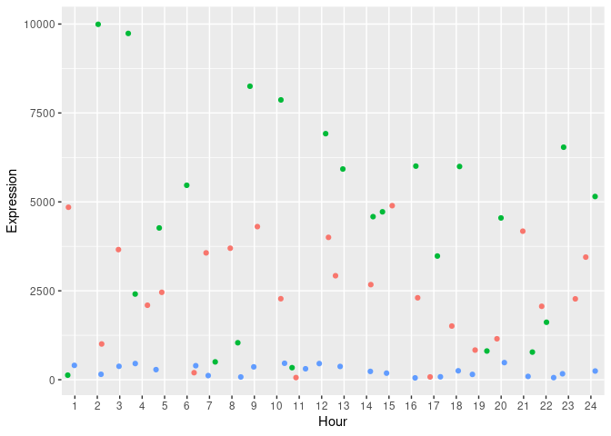
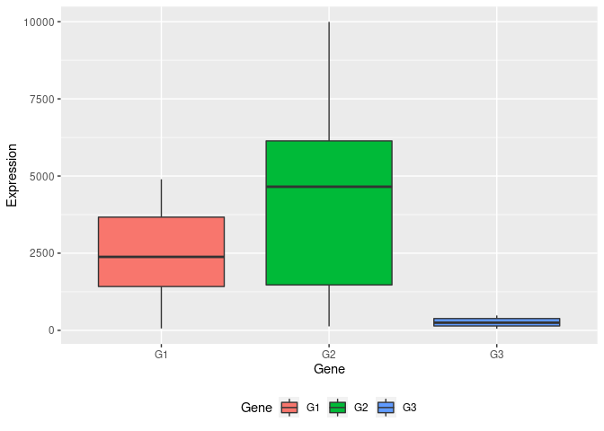
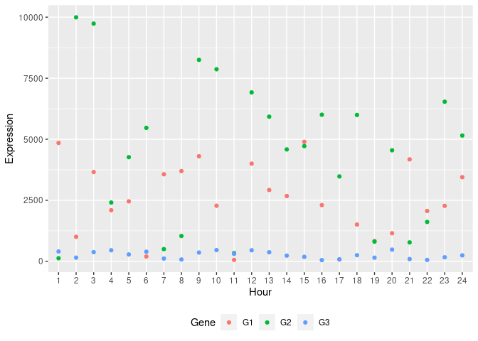

### Step 1: Generate R plots

Since we are checking the expression values between different genes are similar or different, this will be an unpaired student t-test because the testing Genes are different.

But if the for the same Gene, if I check the expression from first 12 hours and next 12 hours then it will be paired t-test since the Gene is same in the both test.


```r
setwd("/home/prakki/Documents/LeaRn")

df <- read.csv("test.csv", header = TRUE)
head(df)
```

```
##   Hour   G1   G2  G3
## 1    1 4849  129 404
## 2    2 1005 9993 153
## 3    3 3658 9736 378
## 4    4 2094 2409 455
## 5    5 2457 4267 284
## 6    6  198 5466 395
```

```r
library(dplyr)
glimpse(df)
```

```
## Rows: 24
## Columns: 4
## $ Hour <int> 1, 2, 3, 4, 5, 6, 7, 8, 9, 10, 11, 12, 13, 14, 15, 16, 17, 18, 19…
## $ G1   <int> 4849, 1005, 3658, 2094, 2457, 198, 3566, 3697, 4304, 2278, 61, 40…
## $ G2   <int> 129, 9993, 9736, 2409, 4267, 5466, 501, 1039, 8251, 7867, 339, 69…
## $ G3   <int> 404, 153, 378, 455, 284, 395, 116, 77, 362, 462, 308, 455, 373, 2…
```

```r
df$Hour <- as.factor(df$Hour)
glimpse(df)
```

```
## Rows: 24
## Columns: 4
## $ Hour <fct> 1, 2, 3, 4, 5, 6, 7, 8, 9, 10, 11, 12, 13, 14, 15, 16, 17, 18, 19…
## $ G1   <int> 4849, 1005, 3658, 2094, 2457, 198, 3566, 3697, 4304, 2278, 61, 40…
## $ G2   <int> 129, 9993, 9736, 2409, 4267, 5466, 501, 1039, 8251, 7867, 339, 69…
## $ G3   <int> 404, 153, 378, 455, 284, 395, 116, 77, 362, 462, 308, 455, 373, 2…
```

```r
summary(df)
```

```
##       Hour          G1             G2             G3       
##  1      : 1   Min.   :  61   Min.   : 129   Min.   : 52.0  
##  2      : 1   1st Qu.:1420   1st Qu.:1471   1st Qu.:142.2  
##  3      : 1   Median :2380   Median :4652   Median :248.5  
##  4      : 1   Mean   :2521   Mean   :4461   Mean   :259.5  
##  5      : 1   3rd Qu.:3668   3rd Qu.:6138   3rd Qu.:382.2  
##  6      : 1   Max.   :4894   Max.   :9993   Max.   :482.0  
##  (Other):18
```

```r
# wide to long
library(reshape2)
df.long <- melt(df, id.vars = c("Hour"), value.name = "Expression", variable.name = c("Gene"))
head(df.long)
```

```
##   Hour Gene Expression
## 1    1   G1       4849
## 2    2   G1       1005
## 3    3   G1       3658
## 4    4   G1       2094
## 5    5   G1       2457
## 6    6   G1        198
```

```r
library(ggplot2)

ggplot(df.long) +
  aes(x = Hour, y = Expression, color = Gene) +
  geom_jitter() +
   theme(legend.position = "none")
```

<!-- -->

```r
ggplot(df.long, aes(x = Gene, y = Expression, fill = Gene)) +
  geom_boxplot() +
  theme(legend.position = "bottom")
```

<!-- -->

```r
#Our objective is to test the following assumption:

#H0: There is no difference in gene expression among the 3 genes across 24 hour period
#H1: There is difference in gene expression atleast in 1 gene across 24 hour period

one.way <- aov(Expression ~ Gene, data = df.long)

summary(one.way)
```

```
##             Df    Sum Sq   Mean Sq F value   Pr(>F)    
## Gene         2 212231536 106115768   28.48 9.58e-10 ***
## Residuals   69 257063237   3725554                     
## ---
## Signif. codes:  0 '***' 0.001 '**' 0.01 '*' 0.05 '.' 0.1 ' ' 1
```

```r
# Compute which genes are significantly different from each other

#If you want to conduct all pairwise t-tests then this is a multiple testing problem and the corresponding p-values should be adjusted for that. 
#The pairwise.t.test() function in base R has a number of methods for this, defaulting to Holm's.

pairwise.t.test(df.long$Expression, df.long$Gene)
```

```
## 
## 	Pairwise comparisons using t tests with pooled SD 
## 
## data:  df.long$Expression and df.long$Gene 
## 
##    G1      G2     
## G2 0.00087 -      
## G3 0.00026 4.2e-10
## 
## P value adjustment method: holm
```

```r
# Pairwise comparisons using t tests with pooled SD 
# 
# data:  df.long$Expression and df.long$Gene 
# 
# G1      G2     
# G2 0.00087 -      
# G3 0.00026 4.2e-10

# P value adjustment method: holm 

pairwise.t.test(df.long$Expression, df.long$Gene, p.adjust.method="none", paired=FALSE, pool.sd=FALSE )
```

```
## 
## 	Pairwise comparisons using t tests with non-pooled SD 
## 
## data:  df.long$Expression and df.long$Gene 
## 
##    G1      G2     
## G2 0.0075  -      
## G3 1.2e-07 5.3e-07
## 
## P value adjustment method: none
```

```r
# Pairwise comparisons using t tests with non-pooled SD 
# 
# data:  df.long$Expression and df.long$Gene 
# 
# G1      G2     
# G2 0.0075  -      
# G3 1.2e-07 5.3e-07

# P value adjustment method: none 

# Can see from the above result that G1 and G2, G1 and G3, G2 and G3 are significantly different from each other.

#Let us individually run the t test between G1 and G2
t.test(df$G1,df$G2) #p-value = 0.007508
```

```
## 
## 	Welch Two Sample t-test
## 
## data:  df$G1 and df$G2
## t = -2.8456, df = 33.516, p-value = 0.007508
## alternative hypothesis: true difference in means is not equal to 0
## 95 percent confidence interval:
##  -3326.322  -553.761
## sample estimates:
## mean of x mean of y 
##  2520.792  4460.833
```

```r
t.test(df$G2,df$G3) #p-value = 5.261e-07
```

```
## 
## 	Welch Two Sample t-test
## 
## data:  df$G2 and df$G3
## t = 6.8596, df = 23.107, p-value = 5.261e-07
## alternative hypothesis: true difference in means is not equal to 0
## 95 percent confidence interval:
##  2934.694 5468.056
## sample estimates:
## mean of x mean of y 
## 4460.8333  259.4583
```

```r
t.test(df$G1,df$G3) #p-value = 1.184e-07
```

```
## 
## 	Welch Two Sample t-test
## 
## data:  df$G1 and df$G3
## t = 7.4783, df = 23.442, p-value = 1.184e-07
## alternative hypothesis: true difference in means is not equal to 0
## 95 percent confidence interval:
##  1636.454 2886.213
## sample estimates:
## mean of x mean of y 
## 2520.7917  259.4583
```

```r
# https://stackoverflow.com/questions/11454521/r-t-test-and-pairwise-t-test-give-different-results

# Two-way ANOVA

# Previously we had only Gene and Expression for running ANOVA. Now let us use the Hour also into the ANOVA so that would make it Two-way ANOVA
# In this study, a research wants to evaluate if there is a significant two-way interaction between Gene and Hour on explaining the Expression level.

head(df)
```

```
##   Hour   G1   G2  G3
## 1    1 4849  129 404
## 2    2 1005 9993 153
## 3    3 3658 9736 378
## 4    4 2094 2409 455
## 5    5 2457 4267 284
## 6    6  198 5466 395
```

```r
df2.long <- melt(df, id.vars = c("Hour"), value.name = "Expression", variable.name = c("Gene"))
head(df2.long)
```

```
##   Hour Gene Expression
## 1    1   G1       4849
## 2    2   G1       1005
## 3    3   G1       3658
## 4    4   G1       2094
## 5    5   G1       2457
## 6    6   G1        198
```

```r
glimpse(df2.long)
```

```
## Rows: 72
## Columns: 3
## $ Hour       <fct> 1, 2, 3, 4, 5, 6, 7, 8, 9, 10, 11, 12, 13, 14, 15, 16, 17, …
## $ Gene       <fct> G1, G1, G1, G1, G1, G1, G1, G1, G1, G1, G1, G1, G1, G1, G1,…
## $ Expression <int> 4849, 1005, 3658, 2094, 2457, 198, 3566, 3697, 4304, 2278, …
```

```r
summary(df2.long)
```

```
##       Hour    Gene      Expression  
##  1      : 3   G1:24   Min.   :  52  
##  2      : 3   G2:24   1st Qu.: 302  
##  3      : 3   G3:24   Median :1330  
##  4      : 3           Mean   :2414  
##  5      : 3           3rd Qu.:4200  
##  6      : 3           Max.   :9993  
##  (Other):54
```

```r
ggplot(df2.long, aes(x = Hour, y = Expression, color = Gene)) +
  #geom_boxplot() +
  geom_point() +
  theme(legend.position = "bottom")
```

<!-- -->

```r
two.way <- aov(Expression ~ Gene + Hour, data = df2.long)

summary(two.way)
```

```
##             Df    Sum Sq   Mean Sq F value  Pr(>F)    
## Gene         2 212231536 106115768  28.938 7.3e-09 ***
## Hour        23  88383092   3842743   1.048   0.433    
## Residuals   46 168680145   3666960                    
## ---
## Signif. codes:  0 '***' 0.001 '**' 0.01 '*' 0.05 '.' 0.1 ' ' 1
```

```r
# Df    Sum Sq   Mean Sq F value  Pr(>F)    
# Gene         2 212231536 106115768  28.938 7.3e-09 ***
# Hour        23  88383092   3842743   1.048   0.433    
# Residuals   46 168680145   3666960                    
# ---
#   Signif. codes:  0 ‘***’ 0.001 ‘**’ 0.01 ‘*’ 0.05 ‘.’ 0.1 ‘ ’ 1

# The p-value for Gene is 7.3e-09, which indicates that the Expression of Genes are significantly different from each other 
# but the Expression at each Hour are not significantly different.
```
